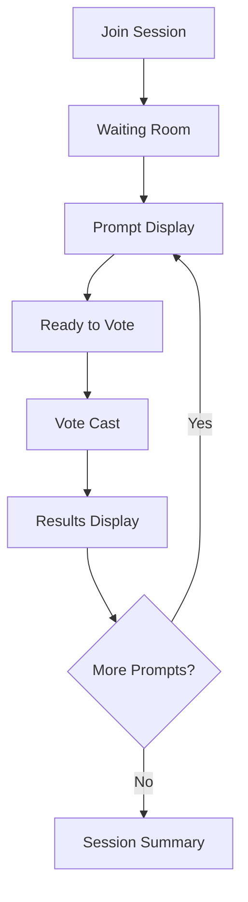
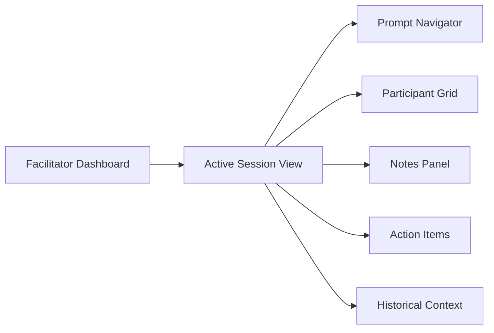
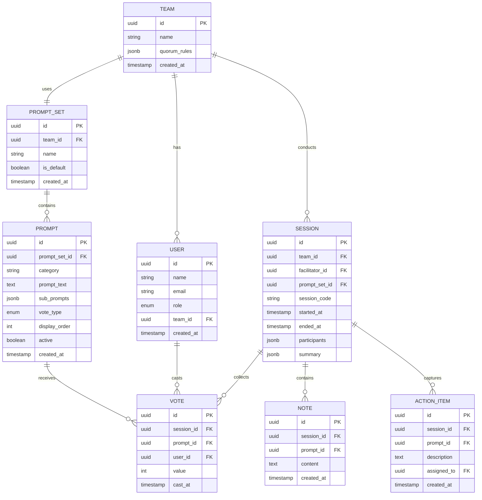
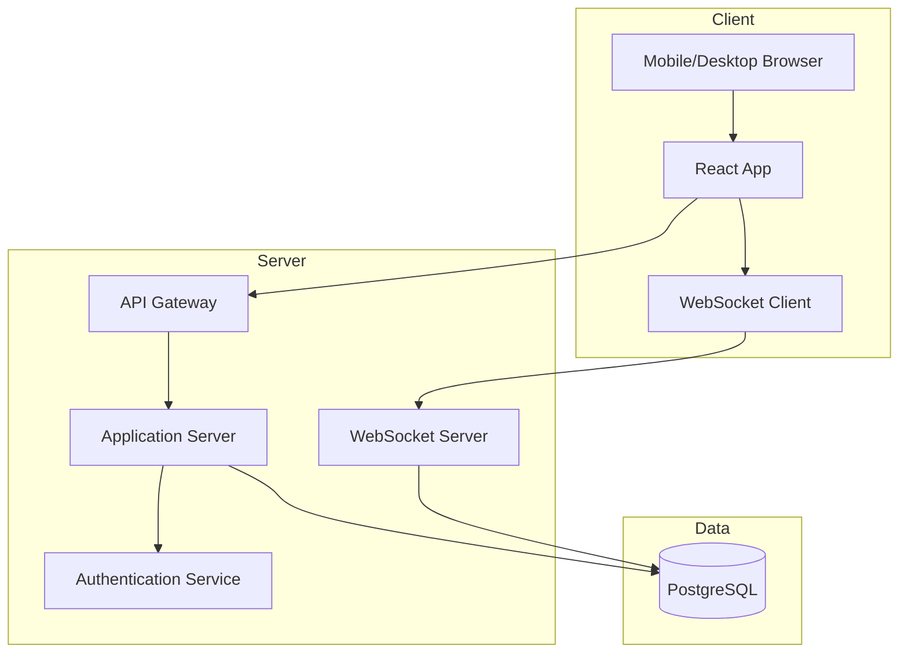

# Business Requirements Document
## Engineering Health Check Tool

**Version:** 1.0  
**Date:** November 10, 2025  
**Status:** Draft

---

## Executive Summary

This document defines the business requirements for a web-based tool to facilitate Engineering Health Check sessions. The tool enables engineering teams to conduct structured retrospectives focused on code quality, development experience, and team health through facilitated voting sessions with real-time anonymous feedback and historical trend tracking.

---

## Background

The Engineering Health Check is a recurring retrospective ritual for engineering teams, focusing on the process of developing and maintaining application code. Currently conducted manually with spreadsheets and physical hand voting, this practice lacks:

- Efficient data collection and aggregation
- Real-time anonymous voting feedback
- Historical trend visualization
- Standardized facilitation workflow
- Flexible prompt management per team

---

## Business Objectives

1. **Streamline Facilitation:** Reduce facilitator overhead and session setup time
2. **Enhance Participation:** Enable anonymous voting to encourage honest feedback
3. **Improve Insights:** Provide real-time aggregation and historical trend analysis
4. **Enable Customization:** Allow teams to adapt prompts to their specific needs
5. **Support Remote/Hybrid:** Enable distributed teams to participate effectively

---

## Stakeholders

| Role | Responsibilities | Needs |
|------|------------------|-------|
| **Session Facilitator** | Leads the health check, manages session flow, captures action items | Clear facilitation workflow, visibility into individual votes, session control |
| **Team Engineer** | Participates in voting and discussion | Simple voting interface, anonymity, aggregate feedback visibility |
| **Engineering Manager** | Reviews historical trends, monitors team health | Historical data access, trend reports |
| **System Administrator** | Manages teams and user access | Team/user management interface |

---

## Scope

### In Scope

- Team and user management
- Session waiting room
- Facilitation workflow with session controls
- Anonymous voting (finger votes 1-4, Roman votes up/down/sideways)
- Real-time vote aggregation with visual feedback
- Action item and note capture during sessions
- End-of-session summary generation
- Historical data storage and trending
- Customizable prompt model per team
- Default prompt set based on standard Engineering Health Check

### Out of Scope

- Session scheduling and calendar integration
- Post-session action item tracking/management
- Integration with external project management tools
- Video conferencing capabilities
- Authentication integration (initial release uses simple auth)

---

## User Personas

### Persona 1: The Facilitator (Alex)
**Role:** Senior Engineer from another team  
**Experience:** 8+ years, has facilitated multiple health checks  
**Goals:**
- Efficiently guide the team through prompts
- Identify outliers for discussion
- Capture insights without disrupting flow
- Track trends over time

**Pain Points:**
- Manual vote tallying is slow and error-prone
- Difficult to notice outliers in real-time
- Spreadsheet management is cumbersome
- Hard to see historical context during sessions

### Persona 2: The Team Member (Jordan)
**Role:** Engineer on the product team  
**Experience:** 3 years, participates in bi-weekly health checks  
**Goals:**
- Provide honest feedback without judgment
- Understand team sentiment on issues
- See how team health trends over time

**Pain Points:**
- Hand voting can feel exposed
- Unclear if their perspective is an outlier
- Can't easily see historical context
- Hard to participate when remote

### Persona 3: The Engineering Manager (Sam)
**Role:** Engineering Manager overseeing 3 product teams  
**Experience:** 12+ years  
**Goals:**
- Monitor team health across multiple teams
- Identify deteriorating trends early
- Understand team-specific challenges

**Pain Points:**
- Inconsistent data format across teams
- No easy way to compare team trends
- Delayed visibility into issues

---

## Functional Requirements

### FR-1: Team Management

**FR-1.1** System shall allow administrators to create teams  
**FR-1.2** System shall allow administrators to add/remove team members  
**FR-1.3** System shall allow administrators to designate facilitators (external to team)  
**FR-1.4** System shall store team membership and role information

### FR-2: Prompt Management

**FR-2.1** System shall provide an abstract prompt model with the following attributes:
- Prompt text (question)
- Voting type (finger vote 1-4, Roman vote up/down, Roman vote up/sideways/down)
- Category/grouping
- Sub-prompts (thinking points)
- Active/inactive status

**FR-2.2** System shall include a default prompt set matching the standard Engineering Health Check topics:
- Developing and Changing Code (4 prompts)
- Automated Development Tests (5 prompts)
- Others (3 prompts)
- Overall (1 prompt)

**FR-2.3** System shall allow teams to customize their prompt set by:
- Activating/deactivating prompts
- Creating custom prompts
- Modifying prompt text and sub-prompts
- Reordering prompts

**FR-2.4** System shall maintain prompt history when prompts are modified (versioning)

### FR-3: Session Workflow

#### FR-3.1: Session Creation

**FR-3.1.1** Facilitator shall be able to create a new session for a team  
**FR-3.1.2** System shall generate a unique session code/URL  
**FR-3.1.3** System shall use the team's active prompt set for the session

#### FR-3.2: Waiting Room

**FR-3.2.1** Team members shall be able to join session via code/URL  
**FR-3.2.2** System shall display waiting room showing:
- Session name/team
- Participants who have joined
- "Waiting for facilitator to start" message

**FR-3.2.3** Facilitator shall see waiting room with:
- List of joined participants
- List of expected team members (not yet joined)
- "Start Session" button (enabled when quorum rules met)

**FR-3.2.4** System shall allow teams to define quorum rules (minimum participants)

#### FR-3.3: Facilitation Controls

**FR-3.3.1** Facilitator shall be able to:
- Navigate to next/previous prompt
- Display current prompt to all participants
- Open voting for current prompt
- Close voting for current prompt
- Add notes to current prompt
- Flag prompt for discussion
- End session

**FR-3.3.2** System shall track session state:
- Current prompt
- Voting open/closed status
- Prompts completed
- Session start time

#### FR-3.4: Voting Process

**FR-3.4.1** When voting opens, participants shall see:
- Current prompt text
- Sub-prompts (thinking points)
- Voting interface (1-4 fingers or thumbs up/down/sideways)
- "Ready to vote" button

**FR-3.4.2** Participants shall indicate readiness by clicking "Ready to vote"

**FR-3.4.3** When all participants are ready, system shall display countdown (e.g., "1-2-3-vote")

**FR-3.4.4** Participants shall cast vote during countdown completion

**FR-3.4.5** System shall immediately display real-time aggregate as graduated progress bar

**FR-3.4.6** For finger votes (1-4), progress bar shall show:
- Distribution across 1, 2, 3, 4 values
- Average score
- Total votes cast

**FR-3.4.7** For Roman votes, progress bar shall show:
- Count of up/down/sideways
- Percentage distribution
- Total votes cast

**FR-3.4.8** Participant view shall show only aggregates (anonymous)

**FR-3.4.9** Facilitator view shall show:
- Individual votes with participant names
- Aggregate visualization
- Outlier indicators (votes >1.5 standard deviations from mean, or as configurable threshold)

**FR-3.4.10** System shall prevent vote changes after submission

**FR-3.4.11** System shall allow facilitator to re-open voting if needed

#### FR-3.5: Discussion and Notes

**FR-3.5.1** Facilitator shall be able to add free-form notes to any prompt

**FR-3.5.2** System shall timestamp all notes

**FR-3.5.3** Facilitator shall be able to flag prompts for follow-up discussion

### FR-4: Action Items

**FR-4.1** During session, facilitator shall be able to capture action items with:
- Description
- Assigned to (optional)
- Related prompt (optional)

**FR-4.2** System shall display action items in session summary

**FR-4.3** System shall not provide post-session action item tracking (out of scope)

### FR-5: Session Summary

**FR-5.1** At session end, system shall generate summary containing:
- Session date/time and duration
- Participants
- Vote results for each prompt (aggregates)
- Prompts flagged for discussion
- All notes captured
- Action items captured
- Comparison to previous session (trend indicators)

**FR-5.2** System shall allow facilitator to export summary as:
- Markdown format
- PDF format

**FR-5.3** System shall allow facilitator to share summary URL with team

### FR-6: Historical Data and Trending

**FR-6.1** System shall store all session data including:
- Date/time
- Participants
- Individual votes (for facilitator/admin access only)
- Aggregates
- Notes and action items

**FR-6.2** System shall provide historical view showing:
- Line chart of average scores over time per prompt
- Trend indicators (improving, steady, declining)
- Session-over-session comparison
- Date range filtering

**FR-6.3** System shall calculate and display:
- Moving averages (configurable window, default 3 sessions)
- Variance indicators
- Significant changes (threshold configurable, default >0.5 change)

**FR-6.4** Participants shall see only aggregate historical data

**FR-6.5** Facilitators and managers shall see individual vote history

**FR-6.6** System shall support exporting historical data as CSV

### FR-7: Access Control

**FR-7.1** System shall enforce role-based access:
- **Facilitator:** Full session control, can see individual votes, can access historical data
- **Team Member:** Can vote, see aggregates, view team's historical aggregates
- **Manager:** Can view all teams' historical data (aggregate and individual)
- **Administrator:** Can manage teams, users, and prompts

**FR-7.2** System shall prevent team members from seeing other's individual votes

**FR-7.3** System shall prevent participants from viewing session data for teams they're not members of

---

## Non-Functional Requirements

### NFR-1: Performance

**NFR-1.1** System shall support concurrent sessions for up to 50 teams  
**NFR-1.2** Vote aggregation shall display within 500ms of last participant voting  
**NFR-1.3** Historical data queries shall return results within 2 seconds

### NFR-2: Usability

**NFR-2.1** Application shall be responsive and functional on devices with minimum 360px width  
**NFR-2.2** Voting interface shall be operable with one hand on mobile devices  
**NFR-2.3** Session join process shall require no more than 2 steps (enter code, confirm)  
**NFR-2.4** System shall provide clear visual feedback for all state changes

### NFR-3: Reliability

**NFR-3.1** System shall maintain real-time connection during sessions with automatic reconnection  
**NFR-3.2** System shall persist votes immediately upon submission  
**NFR-3.3** System shall recover gracefully from network interruptions without data loss

### NFR-4: Security

**NFR-4.1** System shall encrypt all data in transit (TLS 1.3+)  
**NFR-4.2** System shall encrypt sensitive data at rest (individual vote data)  
**NFR-4.3** System shall implement session timeout (configurable, default 4 hours)  
**NFR-4.4** System shall log all access to individual vote data for audit

### NFR-5: Maintainability

**NFR-5.1** System shall be built with automated tests following TDD practices  
**NFR-5.2** System shall support iterative releases with backward compatibility  
**NFR-5.3** System shall use lightweight configuration (environment variables, config files)

---

## User Stories

### Epic 1: Team Setup

**US-1.1** As an administrator, I want to create teams so that I can organize engineers into their product team groups

**US-1.2** As an administrator, I want to add team members so that they can participate in their team's health checks

**US-1.3** As an administrator, I want to assign facilitators from outside the team so that all team members can participate equally

### Epic 2: Session Preparation

**US-2.1** As a facilitator, I want to create a new session so that my team can conduct their health check

**US-2.2** As a facilitator, I want to share a session code/URL so that team members can join easily

**US-2.3** As a team member, I want to join a session via a code/URL so that I can participate from my device

**US-2.4** As a facilitator, I want to see who has joined the waiting room so that I know when we have quorum

### Epic 3: Conducting the Session

**US-3.1** As a facilitator, I want to progress through prompts one at a time so that I can guide the team through the discussion

**US-3.2** As a team member, I want to see the current prompt and thinking points so that I can consider my vote thoughtfully

**US-3.3** As a team member, I want to vote anonymously so that I can provide honest feedback without fear of judgment

**US-3.4** As a team member, I want to see aggregate results in real-time so that I understand team sentiment

**US-3.5** As a facilitator, I want to see individual votes so that I can identify outliers for discussion

**US-3.6** As a facilitator, I want to capture notes during discussion so that I can record insights without disrupting flow

**US-3.7** As a facilitator, I want to capture action items so that the team remembers follow-up tasks

### Epic 4: Understanding Trends

**US-4.1** As a facilitator, I want to see historical trends during the session so that I can provide context to the team

**US-4.2** As a team member, I want to see how our scores have changed over time so that I can understand if we're improving

**US-4.3** As an engineering manager, I want to view trends across multiple teams so that I can identify systemic issues

**US-4.4** As a facilitator, I want to export session summaries so that I can share results with stakeholders

### Epic 5: Customization

**US-5.1** As a team lead, I want to customize our prompt set so that the health check addresses our specific concerns

**US-5.2** As a team lead, I want to create custom prompts so that we can track team-specific metrics

**US-5.3** As a team, we want to start with standard prompts so that we don't have to create everything from scratch

---

## User Interface Requirements

### UI-1: Participant Mobile View

**Key Elements:**
- Large, tappable voting buttons (minimum 44x44px touch target)
- Clear prompt text with collapsible thinking points
- Animated progress bar for results
- Session progress indicator (e.g., "Prompt 5 of 13")

### UI-2: Facilitator Desktop View

**Key Elements:**
- Split-pane layout: prompts on left, voting results on right
- Individual vote display with names
- Outlier highlighting (visual indicators)
- Inline note-taking
- Quick access to previous session data
- Session controls (next/previous, open/close voting, end session)

### UI-3: Historical Trends View

**Key Elements:**
- Multi-line chart showing trends per prompt
- Date range selector
- Team selector (for managers)
- Drill-down to individual sessions
- Export options (CSV, PDF)

---

## Data Model

---

## Technical Architecture (High-Level)

**Key Technical Considerations:**
- Real-time voting requires WebSocket connections
- Responsive design using mobile-first approach
- Progressive Web App capabilities for offline resilience

---

## Assumptions and Constraints

### Assumptions
1. Teams conduct health checks synchronously (all participants online simultaneously)
2. Team size is typically 4-8 engineers
3. Sessions last 30-60 minutes
4. Organizations will have <100 teams using the system concurrently
5. Historical data retention is indefinite (no automatic archival/deletion)

### Constraints
1. Initial release will use simple username/password authentication
2. No integration with external calendar or project management systems
3. No video/audio conferencing capabilities
4. Facilitators must be designated before session creation
5. Quorum rules are basic (minimum participant count only)

---

## Success Metrics

| Metric | Target | Measurement |
|--------|--------|-------------|
| Session setup time | <2 minutes | Time from facilitator login to session start |
| Vote collection time | <30 seconds per prompt | Time from voting open to all votes cast |
| User satisfaction | >4.0/5 | Post-session survey |
| System availability | >99.5% | Uptime monitoring |
| Mobile usability | >90% completion rate | Mobile vs desktop completion rates |
| Adoption | >75% of teams using monthly | Active team count |

---

## Risks and Mitigations

| Risk | Impact | Probability | Mitigation |
|------|--------|-------------|------------|
| Real-time voting drops votes during network issues | High | Medium | Implement persistent WebSocket with automatic reconnection and vote buffering |
| Anonymity breach (technical or social) | High | Low | Encrypt individual votes at rest, audit all access, educate facilitators on privacy |
| Teams customize prompts into unhelpful formats | Medium | Medium | Provide clear guidelines, prompt templates, and validation rules |
| Low adoption due to perceived overhead | Medium | Medium | Streamline setup, demonstrate time savings vs spreadsheets, provide training |
| Facilitator bias in interpreting outliers | Medium | High | Provide statistical context (std dev), training materials on facilitation best practices |
| Scalability limits for large organizations | Medium | Low | Design for horizontal scaling from start, load test before GA release |

---

## Dependencies

1. **Technology Stack Decision:** Framework and database selections must be completed before development
2. **Design System:** UI component library or design system must be established
3. **Hosting Infrastructure:** Cloud provider and deployment strategy must be determined
4. **User Acceptance Testing:** Access to teams willing to pilot the tool

---

## Glossary

| Term | Definition |
|------|------------|
| **Finger Vote** | Voting method using 1-4 fingers to indicate score (1=worst, 4=best) |
| **Roman Vote** | Thumbs up, down, or sideways voting method |
| **Facilitator** | Senior engineer from outside the team who guides the session |
| **Prompt** | A question or topic presented for team voting and discussion |
| **Outlier** | A vote significantly different from the team's aggregate (typically >1.5 std dev) |
| **Quorum** | Minimum number of participants required to start a session |
| **Health Check** | Recurring engineering retrospective focused on code quality and development experience |
| **Graduated Progress Bar** | Visual indicator showing distribution of votes across values |

---

## Appendices

### Appendix A: Default Prompt Set

See cleaned Engineering Health Check document for complete prompt set details.

### Appendix B: Sample Session Flow

1. Facilitator creates session (30 seconds)
2. Team members join waiting room (1-2 minutes)
3. Facilitator starts session
4. For each prompt (13 prompts):
   - Facilitator advances to prompt (5 seconds)
   - Team reads and considers (15 seconds)
   - Team indicates ready (10 seconds)
   - Countdown and vote (5 seconds)
   - Results display (instant)
   - Discussion if outliers (0-3 minutes)
   - Facilitator captures notes (ongoing)
5. Facilitator ends session
6. Summary generated and shared (instant)

**Total estimated time:** 30-45 minutes

### Appendix C: Future Enhancements (Post-MVP)

- Slack/Teams integration for session notifications
- Calendar integration for scheduling
- AI-powered trend insights and recommendations
- Cross-team benchmarking (anonymized)
- Historical data presented as a radar graph
- Action item tracking integration
- SSO/SAML authentication
- Mobile native apps (iOS/Android)

---

## Approval

| Role | Name | Signature | Date |
|------|------|-----------|------|
| Product Owner | | | |
| Engineering Lead | | | |
| UX Lead | | | |
| Engineering Manager | | | |

---

**Document Control:**
- **Location:** `/home/claude/engineering-health-check-brd.md`
- **Last Updated:** November 10, 2025
- **Next Review:** TBD
